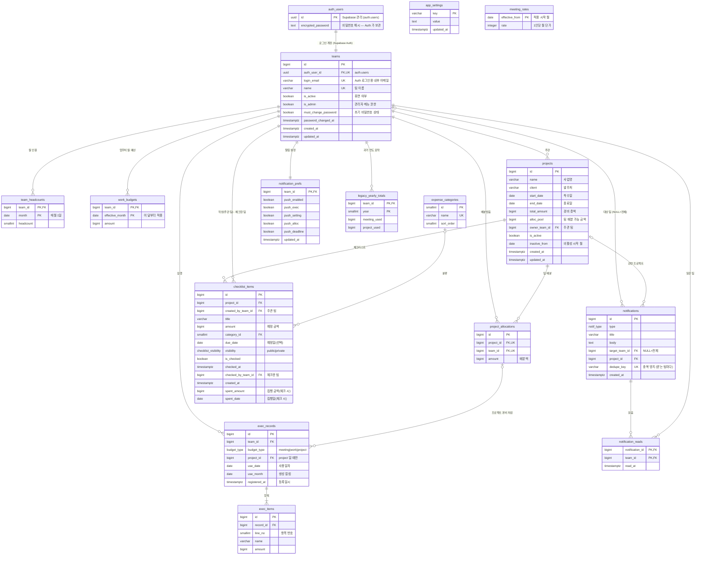

# 코웍-코인 DB 설계 (PostgreSQL · Supabase)

> **v2.7 (2026-10-05)** — **알림 남기기 규칙**. 알림 표 직접 쓰기 금지(앱은 `notify_add`, 비밀번호 알림은 Edge Function) · `notify_add` 는 배분 알림 = 우리 팀 주관 프로젝트에 배분된 팀 앞, 예산 경고·기한 임박 = 우리 팀 앞만(그 밖의 종류·모든 팀 대상 거절) · `dedupe_key` 중복 금지는 받는 팀마다. [`migrations/20261005b_notification_insert_rules.sql`](migrations/20261005b_notification_insert_rules.sql)(SQL Editor 에서 실행).
>
> **v2.5 (2026-10-04)** — **앱 데이터 연동**. 로그인한 팀은 프로젝트·배분·체크리스트·집행·팀 인원·업무비·회의비 단가·알림을 Supabase 에서 읽고 씁니다 (`src/lib/dataApi.ts`). 읽기 = 팀별 RLS(주관·배분받은 프로젝트만, 참여 팀은 공개 체크리스트만, 집행은 우리 팀 건 + 주관 프로젝트에 들어온 건), 쓰기 = 권한을 검사하는 서버 함수(`save_project` · `checklist_*` · `exec_*` · `set_meeting_rate` · `notify_add`). 컬럼 추가: `projects.memo` · `project_allocations.use_end_date` · `expense_categories.team_id`(팀이 만든 구분). [`migrations/20261004_app_data_v2_5.sql`](migrations/20261004_app_data_v2_5.sql) + 삭제가 들어간 함수 [`20261004b_…`](migrations/20261004b_app_data_v2_5_delete_functions.sql)(SQL Editor 에서 실행).
>
> **v2.4 (2026-09-28)** — 팀 로그인 **Edge Function 5개**([`supabase/functions`](../supabase/functions))와 **앱 로그인 연동**. `VITE_SUPABASE_URL` · `VITE_SUPABASE_ANON_KEY` 가 있으면 로그인·팀 계정을 Supabase 로 처리하고, 없으면 지금처럼 브라우저 저장본으로 로그인합니다. 프로젝트·집행 데이터는 아직 브라우저 저장본입니다(다음 단계 RLS 정책). [§2-1 Edge Function](#edge-function-supabasefunctions).
>
> **v2.3 (2026-09-28)** — 체크리스트 **집행일** `checklist_items.spent_date` 추가. 체크하면 예정일 자리에 집행일(기본 = 체크한 날, 수정 가능)을 보여 주고, 예정일(`due_date`)은 그대로 둬 체크를 풀면 돌아갑니다. 완료 항목의 체크 해제·금액·집행일 수정은 화면의 **잠금** 버튼을 풀어야 가능합니다(오클릭 방지 · 화면 기능이라 DB 에 저장 안 함). 이미 만든 DB 는 v2.2 다음에 [`migrations/20260928b_checklist_spent_date.sql`](migrations/20260928b_checklist_spent_date.sql) 을 실행합니다.
>
> **v2.2 (2026-09-28)** — 체크리스트 **집행 금액** `checklist_items.spent_amount` 추가. 체크할 때 입력하고 기본값은 예정 금액(예산), 체크한 항목에만 값이 있습니다. 화면은 집행 금액을 크게, 예산을 작게 보여 줍니다. 이미 만든 DB 는 [`migrations/20260928_checklist_spent_amount.sql`](migrations/20260928_checklist_spent_amount.sql) 을 실행합니다.
>
> **v2.1 (2026-09-28)** — 결정 반영: 임시 비밀번호 8자(한 번만 표시) · 새 비밀번호 8자 이상 · 이력 있는 팀은 삭제 대신 휴면 ([§5](#5-확인이-필요한-점-설계-가정) 4·6). 앱에도 같은 규칙을 적용했습니다.
>
> **v2 (2026-09-27)** — 팀·로그인을 **Supabase Auth** 기준으로 바꿨습니다. 비밀번호는 DB 테이블에 저장하지 않고, 별도 관리자 전용 계정이 없어졌으며(첫 실행 때 만든 팀이 관리자), 초기 비밀번호 강제 변경이 들어갔습니다. 바뀐 곳: [§1 ERD](#1-erd) `teams` · [§2-1 로그인·계정](#2-1-로그인--계정-supabase-auth) · [§4](#4-현재-앱-저장-구조에서-바뀐-점) · [§5](#5-확인이-필요한-점-설계-가정).

- 파일
  - [`schema.sql`](schema.sql) — 테이블·제약·뷰 (일반 PostgreSQL에서도 실행됨)
  - [`supabase.sql`](supabase.sql) — Supabase 전용: `auth.users` 연결, 로그인한 팀 확인 함수, RLS, 로그인 화면·관리자 메뉴 함수
  - [`migrations/`](migrations/) — 이미 적용된 DB 에 추가로 실행하는 변경 (새 DB 는 schema.sql 에 이미 포함)
  - [`seed.sql`](seed.sql) — 오픈 전 검증용 테스트 데이터 (운영 Supabase 에 넣어 검증)
  - [`cleanup_test_data.sql`](cleanup_test_data.sql) — 오픈 직전 테스트 데이터 전부 삭제 (기준 정보는 유지, 첫 실행 상태로)
- 실행 순서: `schema.sql` → `supabase.sql` (Supabase SQL Editor 또는 마이그레이션)
- 원칙: **입력값만 저장**하고, 사용액·잔액·분기 예산·집행률 같은 **계산값은 뷰(`v_*`)로 조회**합니다. 금액은 원 단위 `bigint`.

## 1. ERD

영역별로 보면 다음과 같습니다.

| 영역 | 테이블 |
|---|---|
| 팀·설정 | `teams` (+ Supabase `auth.users`), `app_settings` |
| 팀 운영 예산 | `meeting_rates`, `team_headcounts`, `work_budgets` |
| 프로젝트 운영 | `projects`, `project_allocations`, `checklist_items`, `expense_categories` |
| 집행 | `exec_records`, `exec_items` |
| 알림 | `notifications`, `notification_reads`, `notification_prefs` |
| 리포트 이관 | `legacy_yearly_totals` |

## 2. 테이블 정의서

표기: **PK** 기본키 · **FK** 외래키 · **UK** 유일 · 필수 = NOT NULL

### teams — 팀 계정 (로그인 단위)
팀 1개 = Supabase Auth 사용자 1명입니다. 팀원들이 같은 팀 계정으로 로그인합니다. 비밀번호는 Auth(`auth.users`)가 해시로 보관하고 이 테이블에는 없습니다.

| 컬럼 | 타입 | 필수 | 키 | 설명 |
|---|---|:-:|:-:|---|
| id | bigint (identity) | ● | PK | 모든 이력은 이 id 로 연결 (팀 이름을 바꿔도 끊기지 않음) |
| auth_user_id | uuid | ● | UK, FK→auth.users | 삭제 제한(RESTRICT) — 팀 행을 먼저 지우고 Auth 사용자를 지움 |
| login_email | varchar(100) | ● | UK | Auth 로그인용 **내부 이메일** (예: `team-3f9a2c1b@teams.cowork-coin.app`). 화면에는 안 보이고 메일도 보내지 않음 — 팀 이름이 한글이라 따로 둠 |
| name | varchar(50) | ● | UK | 팀 이름 (예: 개발팀), 빈 값 금지 |
| is_active | boolean | ● | | false = 휴면 — 로그인 팀 목록에서 빠지고 로그인해도 데이터 접근 차단. 기본 true |
| is_admin | boolean | ● | | 관리자 메뉴 권한. **활성 관리자 팀은 최소 1개** (트리거 `teams_keep_admin`) |
| must_change_password | boolean | ● | | **초기 비밀번호 상태**. 팀 추가·관리자 초기화 때 true, 팀이 직접 바꾸면 false. true 인 동안 앱 데이터 접근 차단(§2-1). 기본 true |
| password_changed_at | timestamptz | | | 팀이 직접 마지막으로 바꾼 시각 (초기화하면 NULL) |
| created_at / updated_at | timestamptz | ● | | 수정 시 updated_at 자동 갱신 |

### app_settings — 시스템 설정 (키-값)
v2에서 비밀번호 관련 키(`admin_password_hash`, `reset_password_hash`)를 없앴습니다. 관리자 전용 계정은 없고, 초기 비밀번호는 Edge Function 설정(Secrets)에서 관리합니다. 이후 시스템 설정용으로 남겨 둡니다.

| 컬럼 | 타입 | 필수 | 키 | 설명 |
|---|---|:-:|:-:|---|
| key | varchar(50) | ● | PK | |
| value | text | ● | | |
| updated_at | timestamptz | ● | | |

### meeting_rates — 팀 회의비 1인당 월 단가 이력
| 컬럼 | 타입 | 필수 | 키 | 설명 |
|---|---|:-:|:-:|---|
| effective_from | date | ● | PK | 적용 시작 월 (매월 1일). 다음 변경 전까지 적용 |
| rate | integer | ● | | 1인당 월 단가 (> 0), 현재 30,000원 |

### team_headcounts — 팀 월별 인원
| 컬럼 | 타입 | 필수 | 키 | 설명 |
|---|---|:-:|:-:|---|
| team_id | bigint | ● | PK, FK→teams | |
| month | date | ● | PK | 매월 1일 |
| headcount | smallint | ● | | ≥ 0. **분기 회의비 예산 = Σ(월 인원 × 그 달 단가)** |

### work_budgets — 팀 업무비 월 예산
| 컬럼 | 타입 | 필수 | 키 | 설명 |
|---|---|:-:|:-:|---|
| team_id | bigint | ● | PK, FK→teams | |
| effective_month | date | ● | PK | 이 달부터 다음 입력 전까지 같은 금액 (이월 없음, 남으면 소멸) |
| amount | bigint | ● | | ≥ 0 |

### projects — 프로젝트
| 컬럼 | 타입 | 필수 | 키 | 설명 |
|---|---|:-:|:-:|---|
| id | bigint (identity) | ● | PK | |
| name | varchar(100) | ● | | 사업명 |
| client | varchar(100) | | | 발주처 |
| start_date / end_date | date | ● | | 착수일 / 종료일 (종료 ≥ 착수) |
| total_amount | bigint | ● | | 프로젝트 경비 총액 |
| alloc_pool | bigint | ● | | 코웍 팀 배분 가능 금액 (≤ 총액) |
| owner_team_id | bigint | ● | FK→teams | 주관(등록) 팀 |
| is_active | boolean | ● | | 기본 true |
| inactive_from | date | | | '이 달부터 비활성' 월 |
| created_at / updated_at | timestamptz | ● | | |

### project_allocations — 프로젝트 팀 배분 (= 참여 팀)
| 컬럼 | 타입 | 필수 | 키 | 설명 |
|---|---|:-:|:-:|---|
| id | bigint (identity) | ● | PK | |
| project_id | bigint | ● | FK→projects, UK(project_id, team_id) | 프로젝트 삭제 시 함께 삭제 |
| team_id | bigint | ● | FK→teams | |
| amount | bigint | ● | | 배분액. **팀 배분 합계 ≤ alloc_pool** (트리거, 트랜잭션 끝에 검사) |

- **삭제 제한** (트리거 `project_allocations_no_delete_used`): 사용액(프로젝트 경비 집행 이력)이 있는 팀 배분은 삭제할 수 없습니다. 앱은 삭제 대신 **배분액을 사용액으로 맞추기(잔액 0원)** 를 안내합니다.
- **지분율**은 저장하지 않고 `v_allocation_usage.share_pct` 로 계산합니다 (팀 배분액 ÷ 프로젝트 배분 총액). 주관 팀만 프로젝트 상세에서 봅니다.

### expense_categories — 경비 분류
| 컬럼 | 타입 | 필수 | 키 | 설명 |
|---|---|:-:|:-:|---|
| id | smallint (identity) | ● | PK | |
| name | varchar(20) | ● | UK* | 공통: 회의비(원가) · 업무비(원가) · 일반교통비(원가) · 기타(원가) / 팀이 만든 구분 |
| sort_order | smallint | ● | | 표시 순서 |
| team_id | bigint | | FK→teams | 없음 = 모든 팀 공통 구분, 값 = 그 팀이 만든 구분 (v2.5) |

* v2.6([`migrations/20261005_expense_category_team_scope.sql`](migrations/20261005_expense_category_team_scope.sql)): 이름 중복 금지는 공통 구분끼리 · 같은 팀 안에서만 — 팀마다 같은 이름을 따로 가질 수 있음. 읽기 = 공통 · 우리 팀 구분 + 볼 수 있는 체크리스트 항목이 쓰는 구분(코웍 팀도 주관 팀 구분 이름이 보임).

### checklist_items — 경비 집행 체크리스트 (공개 / 비공개)
주관 팀이 만들고 공개 범위를 정합니다. 금액 기준은 **주관 팀의 My 경비 배분 금액**(project_allocations 중 주관 팀 행)이며, 참여 팀의 배분 예산과는 별개입니다. **공개** = 주관 팀 + 배분받은 코웍 팀이 보고 체크, **비공개** = 주관 팀만. 생성·삭제·공개 범위 변경은 주관 팀만.

| 컬럼 | 타입 | 필수 | 키 | 설명 |
|---|---|:-:|:-:|---|
| id | bigint (identity) | ● | PK | |
| project_id | bigint | ● | FK→projects | 프로젝트 삭제 시 함께 삭제 |
| created_by_team_id | bigint | ● | FK→teams | 작성 팀 = 프로젝트 주관 팀 (트리거 검사) |
| visibility | enum `checklist_visibility` | ● | | `public` 공개(기본) · `private` 비공개 |
| checked_by_team_id | bigint | | FK→teams | 체크한 팀 — 주관 팀 또는 공개 항목의 배분받은 팀 (트리거 검사) |
| title | varchar(100) | ● | | 항목명 |
| amount | bigint | ● | | 예정 금액 (화면 표시 '예산') |
| category_id | smallint | | FK→expense_categories | |
| due_date | date | | | 예정일 (없으면 '예정일 없음') |
| is_checked | boolean | ● | | 기본 false |
| checked_at | timestamptz | | | 체크한 시각 (미체크면 NULL) |
| created_at | timestamptz | ● | | 항목 번호는 생성 순서 |
| spent_amount | bigint | | | **집행 금액** (v2.2) — 체크할 때 입력, 기본 = `amount`. 체크한 항목만 값이 있고 미체크면 NULL (제약 `checklist_items_spent_check`) |
| spent_date | date | | | **집행일** (v2.3) — 체크할 때 그날로 기본 입력, 수정 가능. 체크한 항목만 값이 있음 (제약 `checklist_items_spent_date_check`). 화면에서 완료 항목은 예정일 대신 이 날짜로 표시·정렬 |

### exec_records — 집행 등록 (헤더)
| 컬럼 | 타입 | 필수 | 키 | 설명 |
|---|---|:-:|:-:|---|
| id | bigint (identity) | ● | PK | |
| team_id | bigint | ● | FK→teams | 집행한 팀 |
| budget_type | enum `budget_type` | ● | | `meeting` 팀 회의비 · `work` 팀 업무비 · `project` 프로젝트 경비 |
| project_id | bigint | | FK→project_allocations(project_id, team_id) | `project`일 때만 필수 — 배분받은 팀만 집행 |
| use_date | date | ● | | 사용일자 |
| use_month | date | ● | | **생성 컬럼** = 사용일자의 월 1일 (예산 집계 기준) |
| registered_at | timestamptz | ● | | 등록일시 |

### exec_items — 집행 항목 (상세)
| 컬럼 | 타입 | 필수 | 키 | 설명 |
|---|---|:-:|:-:|---|
| id | bigint (identity) | ● | PK | |
| record_id | bigint | ● | FK→exec_records | 집행 삭제 시 함께 삭제 |
| line_no | smallint | ● | UK(record_id, line_no) | 항목 번호 |
| name | varchar(100) | ● | | 항목명 |
| amount | bigint | ● | | > 0 |

### notifications — 알림
| 컬럼 | 타입 | 필수 | 키 | 설명 |
|---|---|:-:|:-:|---|
| id | bigint (identity) | ● | PK | |
| type | enum `notif_type` | ● | | exec · setting · alloc · deadline · budget · project · admin · system |
| title | varchar(100) | ● | | |
| body | text | ● | | |
| target_team_id | bigint | | FK→teams | NULL = 모든 팀 |
| project_id | bigint | | FK→projects | 관련 프로젝트 (삭제 시 NULL) |
| dedupe_key | varchar(100) | | UK* | 중복 발송 방지 (예: 기한 임박은 프로젝트·종료월당 1회) — v2.7 부터 (target_team_id, dedupe_key) 로 받는 팀마다 1회 |
| created_at | timestamptz | ● | | |

### notification_reads — 알림 읽음 (팀별)
| 컬럼 | 타입 | 필수 | 키 | 설명 |
|---|---|:-:|:-:|---|
| notification_id | bigint | ● | PK, FK→notifications | |
| team_id | bigint | ● | PK, FK→teams | 전체 대상 알림도 팀마다 따로 읽음 |
| read_at | timestamptz | ● | | |

### notification_prefs — 팀별 알림 설정
| 컬럼 | 타입 | 필수 | 키 | 설명 |
|---|---|:-:|:-:|---|
| team_id | bigint | ● | PK, FK→teams | |
| push_enabled | boolean | ● | | 기기 푸시 전체 on/off (기본 off) |
| push_exec / push_setting / push_alloc / push_deadline | boolean | ● | | 종류별 푸시 on/off (기본 on) |
| updated_at | timestamptz | ● | | |

### legacy_yearly_totals — 과거 연도 집행 요약 (이관분)
| 컬럼 | 타입 | 필수 | 키 | 설명 |
|---|---|:-:|:-:|---|
| team_id | bigint | ● | PK, FK→teams | |
| year | smallint | ● | PK | 상세 이력이 없는 과거 연도 (리포트 연도별 비교용) |
| meeting_used / project_used | bigint | ● | | 연간 회의비 / 프로젝트 집행액 |

## 2-1. 로그인 · 계정 (Supabase Auth)

역할을 셋으로 나눕니다.
- **Supabase Auth**: 비밀번호 보관·검사와 로그인 세션(JWT)
- **DB (`teams` + RLS)**: 팀 정보와 "지금 데이터를 써도 되는 팀인지" 판단
- **Edge Function**: 계정을 만들고 지우거나 비밀번호를 바꾸는 일. Auth 관리자 키(service_role)가 필요해 브라우저에서 직접 할 수 없습니다.

### 흐름 (현재 앱 화면 → Supabase)

| 화면 · 동작 | 지금 앱 (localStorage) | Supabase |
|---|---|---|
| 첫 실행 (팀 0개) | '관리자 팀 만들기' → 첫 팀 = 관리자 | `needs_setup()` 이 true → Edge Function **`bootstrap-admin`**: 팀이 없을 때만 Auth 사용자 + `teams`(is_admin, must_change_password=false) 생성 |
| 로그인 팀 선택 목록 | 활성 팀 | `login_teams()` (로그인 전 호출 가능) — 활성 팀의 이름·내부 이메일만 |
| 로그인 | 팀 + 비밀번호 비교 | `supabase.auth.signInWithPassword({ email: login_email, password })` |
| 로그인 후 팀 정보 | `session = { team, isAdmin }` | 자기 팀 행 조회 (`auth_user_id = auth.uid()`) → name · is_admin · must_change_password |
| 초기 비밀번호 강제 변경 | 비밀번호가 초기값이면 변경 단계 | `must_change_password = true` 면 변경 단계 → Edge Function **`change-password`**: 현재 비밀번호 확인 → 새 비밀번호 저장 → `set_password_state(팀, false)` → '비밀번호 변경 완료' 알림 |
| 마이페이지 비밀번호 변경 | 현재·새·확인 | 같은 **`change-password`** |
| 관리자: 팀 추가 | 임시 비밀번호 8자를 만들어 한 번만 표시 | Edge Function **`admin-create-team`**: 임시 비밀번호 생성 → Auth 사용자(내부 이메일) + `teams`(must_change_password=true) → 임시 비밀번호를 응답으로 한 번만 돌려줌(저장·로그 안 함) |
| 관리자: 비밀번호 초기화 | 새 임시 비밀번호를 한 번만 표시 | Edge Function **`admin-reset-password`**: 임시 비밀번호 생성 → Auth 비밀번호 변경 + `set_password_state(팀, true)` + 다른 기기 세션 끊기 + '비밀번호 초기화' 알림 → 임시 비밀번호 한 번만 응답 |
| 관리자: 이름 · 휴면 · 관리자 권한 | 표에서 바로 변경 | `admin_update_team(팀, 이름, 활성, 관리자)` — 관리자 팀만, 로그인한 팀 자신의 상태·권한은 변경 불가 |
| 관리자: 팀 삭제 | 이력 없는 팀만 삭제, 이력 있으면 휴면 안내 | Edge Function **`admin-delete-team`**: 이력 확인 → 있으면 '휴면 안내' 응답 / 없으면 `teams` 행 삭제 → Auth 사용자 삭제 (외래키가 한 번 더 막음) |
| 로그아웃 | 세션 제거 | `supabase.auth.signOut()` |
| 로그인 정보 저장 · 마지막 팀 | 브라우저 저장 | 그대로 브라우저 저장 (팀 데이터 아님) |

### 서버에서 막는 규칙

| 규칙 | 방법 |
|---|---|
| 초기 비밀번호 팀은 변경 전까지 데이터 접근 불가 | `current_team_id()` 가 NULL → 모든 데이터 정책이 막힘. 자기 팀 행만 보임 |
| 휴면 팀은 로그인해도 데이터 접근 불가 | 같은 방법 (`is_active` 검사) |
| `must_change_password` 를 팀이 직접 해제 불가 | `teams` 쓰기 정책 없음, `set_password_state()` 는 service_role 전용 |
| 관리자 메뉴 변경은 관리자 팀만 | `admin_update_team()` 안에서 `is_admin_team()` 검사 |
| 활성 관리자 팀 최소 1개 | 트리거 `teams_keep_admin` |
| 로그인 전에는 팀 이름 목록만 | `login_teams()` 만 anon 허용, 테이블 직접 조회는 0행 |

### 함수 (`supabase.sql`)

| 이름 | 호출 | 내용 |
|---|---|---|
| `needs_setup()` | 로그인 전 | 팀이 하나도 없는지 (첫 실행 화면) |
| `login_teams()` | 로그인 전 | 활성 팀 이름 · 내부 이메일 |
| `auth_team_id()` | 로그인 후 | 로그인한 팀 id (상태 무관) |
| `current_team_id()` | RLS 정책 | 데이터를 쓸 수 있는 팀 id (활성 + 비밀번호 변경 완료), 아니면 NULL |
| `is_admin_team()` | RLS · 관리자 함수 | 로그인한 팀이 관리자인지 |
| `admin_update_team()` | 관리자 메뉴 | 이름 · 휴면 · 관리자 권한 변경 |
| `set_password_state()` | Edge Function 전용 | 초기 비밀번호 상태 기록 |

### Edge Function (`supabase/functions`)

모두 `verify_jwt = false` 로 배포하고(로그인 전 호출 + JWT 가 아닌 publishable 키), 로그인이 필요한 함수는 안에서 `Authorization` 의 세션을 직접 확인합니다(`_shared/mod.ts` `caller`). 관리자 함수는 **활성 · 비밀번호 변경 완료 · 관리자** 팀만 호출할 수 있습니다(`current_team_id()` 와 같은 조건). 오류는 `{ error: 코드, message }` 로 돌려주고, 비밀번호·임시 비밀번호·토큰은 로그에 남기지 않습니다.

| 함수 | 호출 | 입력 → 응답 | 하는 일 |
|---|---|---|---|
| `bootstrap-admin` | 로그인 전 | `{ name, password }` → `{ team: { id, name, login_email } }` | 팀이 없을 때만 첫 관리자 팀(Auth 사용자 + teams, 변경 완료 상태). 동시에 두 번 눌리면 먼저 만든 팀만 남김 |
| `change-password` | 팀 본인 | `{ current, next }` → `{ ok }` | 현재 비밀번호 확인 → 새 비밀번호(8자 이상, 현재와 다름) → `set_password_state(false)` → 다른 기기 세션 끊기 → '비밀번호 변경 완료' 알림 |
| `admin-create-team` | 관리자 | `{ name }` → `{ team, tempPassword }` | 임시 비밀번호 8자 생성 → Auth 사용자(임의 내부 이메일) + teams(`must_change_password`) → 임시 비밀번호는 응답으로 한 번만 |
| `admin-reset-password` | 관리자 | `{ teamId }` → `{ tempPassword }` | 새 임시 비밀번호 → `set_password_state(true)` → '비밀번호 초기화' 알림. 그 팀의 기존 기기 세션은 곧바로 데이터가 막히고(`current_team_id()` NULL), 변경하려면 새 임시 비밀번호가 필요 |
| `admin-delete-team` | 관리자 | `{ teamId }` → `{ ok }` · 409 `has_history` | 로그인한 팀 자신은 불가. 집행 · 배분 · 주관 프로젝트 · 체크리스트(작성·체크) 이력이 있으면 `has_history` → 앱이 휴면 안내. 없으면 teams 행 → Auth 사용자 순서로 삭제 |

- 로그인용 내부 이메일은 팀명과 무관한 임의 값(`team-<16자>@teams.cowork-coin.app`, 함수 환경변수 `LOGIN_EMAIL_DOMAIN` 으로 변경 가능) — 팀명을 바꿔도 로그인 계정은 그대로입니다.
- 앱(`src/lib/authApi.ts`): 로그인 목록 `login_teams()` → `signInWithPassword` → 자기 팀 행 → 임시 비밀번호면 변경 단계 → 전체 팀 목록을 앱 팀 목록으로 맞춤(`SYNC_TEAMS`, 이름이 바뀐 팀은 배분·집행 팀 이름도 함께). 이름 · 휴면 · 관리자 권한은 `admin_update_team()`. 새로고침 때 Auth 세션이 없으면 로그아웃, 임시 비밀번호 상태면 변경 단계(그때는 임시 비밀번호 입력칸이 함께 나옴).

### RLS (이번 단계)
- **모든 테이블에 RLS를 켭니다.** 정책이 없는 테이블은 브라우저(anon·authenticated)에서 읽기와 쓰기가 모두 막힙니다. 이번 단계에서 정책을 넣은 테이블은 `teams` 하나입니다.
- `teams` 조회는 두 경우만 허용합니다: **자기 팀 행**, 또는 **데이터를 쓸 수 있는 팀이 다른 팀을 볼 때**(배분·집행 팀 이름 표시용). 쓰기 정책은 없습니다.
- 뷰(`v_*`)는 `security_invoker` 로 바꿔 조회하는 팀의 RLS를 따르게 했습니다.
- 다음 단계에서 프로젝트·집행·체크리스트·알림 테이블에 `current_team_id()` 기준 정책을 추가합니다.

## 3. 계산값 조회 (뷰 · 함수)

| 이름 | 앱에서 쓰는 곳 | 내용 |
|---|---|---|
| `v_exec_records` | 집행 현황 | 집행 1건 + 항목 합계(`total`) · 항목 수 |
| `v_allocation_usage` | 프로젝트 상세 › 팀 배분 | 프로젝트 × 팀 배분액 · 사용액 · 잔액 · **지분율(`share_pct`)** |
| `v_project_owner_budget` | My 체크리스트 · 코웍 체크리스트 · 상세 체크리스트 | 체크리스트 기준 예산 = 주관 팀의 My 경비 배분 금액 · 사용액 · 잔액 |
| `v_project_summary` | 프로젝트 목록 | 배분 가능 금액 · 사용액 · 잔액 · 집행률 |
| `v_team_projects` | My 프로젝트 | 팀이 주관(`owner`)하거나 배분받은(`participant`) 프로젝트 |
| `v_team_checklist` | 프로젝트 운영 › My 체크리스트 (`role='owner'`) · 코웍 체크리스트 메뉴 (`role='participant'`) · 홈 (My/코웍 태그) | 팀별로 보이는 체크리스트 — 주관 프로젝트는 전부, 참여 프로젝트는 공개 항목만 (`role` 표시) |
| `v_team_meeting_quarters` | 팀 회의비 분기표 · 홈 | 팀 · 연도 · 분기별 인원 합, 예산, 사용액, 잔액 |
| `v_team_work_months` | 팀 업무비 표 · 홈 | 팀 · 월별 업무비 예산(이전 입력값 이어 받음), 사용액 |
| `v_team_notifications` | 알림 | 팀별 받은 알림 + 읽음 여부 |
| `meeting_rate_of(월)` | | 그 달에 적용되는 회의비 단가 |
| `work_budget_of(팀, 월)` | 집행 등록 잔액 표시 | 그 달의 업무비 예산 |

## 4. 현재 앱 저장 구조에서 바뀐 점

| 현재 (localStorage) | DB 설계 | 이유 |
|---|---|---|
| 팀을 이름(`'개발팀'`)으로 연결 | `team_id` 외래키 | 팀 이름을 바꿔도 이력이 끊기지 않음 |
| `password` 평문 | Supabase Auth 가 보관 (테이블에 없음) | 보안 · 로그인 세션·재시도 제한을 Auth 가 처리 |
| 관리자 전용 계정 (`admin1234`) | **없음** — v2 앱과 같이 `is_admin` 팀이 관리자 | 앱에서 이미 제거됨 |
| 첫 실행 `INITIALIZE` (첫 팀 = 관리자) | `needs_setup()` + Edge Function `bootstrap-admin` | 팀이 없을 때만 한 번 |
| `Team.mustChangePassword` (임시 비밀번호 상태) | `must_change_password` 컬럼 + RLS 차단 | 앱과 같은 값, 화면을 건너뛰어도 데이터가 막힘 |
| 고정 초기 비밀번호 `1234` · 4자 이상 | 임의 임시 비밀번호 8자(한 번만 표시) · 새 비밀번호 8자 이상 | §5-4 결정 |
| 이력 있는 팀도 삭제 | 이력 있으면 휴면 안내, 없는 팀만 삭제 | §5-6 결정, 외래키와 같은 규칙 |
| `Session { team: 이름, isAdmin }` | Auth 세션(JWT) + 자기 팀 행 | 이름 대신 id, 권한은 서버가 판단 |
| `Project.used`, `AllocRow.used`, `QuarterData.used` 저장 | 저장 안 함 → `v_*` 뷰로 계산 | 집행 이력과 숫자가 어긋나지 않음 |
| `Project.isMine` | `v_team_projects` (주관 또는 배분) | 로그인한 팀마다 다르게 계산되는 값 |
| `QuarterData.budget` 저장 | `team_headcounts` × `meeting_rates` | 인원·단가가 바뀌면 예산이 자동 반영, 과거 단가 유지 |
| `meetingRate` 1개 | `meeting_rates` 이력 | 단가 변경 전 분기는 옛 단가로 계산 |
| `ExecRecord.items` 배열 · `total` | `exec_items` 테이블, 합계는 뷰 | 항목별 검색·집계 가능 |
| `ExecRecord.month` · `date` 문자열 | `use_date` + 생성 컬럼 `use_month`, `registered_at` | 사용월이 사용일자와 항상 일치 |
| 회의비 집행에 팀 없음 | 모든 집행에 `team_id` 필수 | 여러 팀이 같은 DB를 씀 |
| 체크리스트 `ChecklistItem.spent` · `spentDate` (체크 시 집행 금액·집행일, 기본 = 예산·체크한 날) | `spent_amount` · `spent_date` (체크한 항목만 NOT NULL) | 예산·예정일과 실제 집행 금액·날짜를 함께 보관 |
| 체크리스트에 팀 없음 | `created_by_team_id`(주관 팀) · `checked_by_team_id` · `visibility` | 공개 항목은 참여 팀도 보고 체크 |
| 알림 `read` 1개 | `notification_reads` (팀별) | 전체 대상 알림을 팀마다 따로 읽음 |
| `time: '2시간 전'` | `created_at` 시각 | '~전' 표시는 앱에서 계산 |
| `monthly`, `projectMonthly`, `YEARLY_BUDGET` | 저장 안 함 → 집행 이력에서 집계 | 중복 데이터 제거 |
| `YEARLY_HISTORY` | `legacy_yearly_totals` | 상세 이력 없는 과거 연도만 요약으로 보관 |
| 팀 배분 지분율 (화면 계산) | `v_allocation_usage.share_pct` | 배분액이 바뀌면 자동 반영 |
| 사용액 있는 팀 배분 삭제 (화면에서 막음) | 트리거 `project_allocations_no_delete_used` | 다른 경로(API·일괄 작업)로도 삭제 불가 |
| 리포트 보기 형식(카드/리스트), 조회 필터 | 저장 안 함 (기기별 브라우저 저장) | 팀 데이터가 아닌 화면 설정 |

## 5. 확인이 필요한 점 (설계 가정)

1. **프로젝트 경비 집행은 배분받은 팀만** 가능하도록 막았습니다 (외래키). 주관 팀도 배분이 있어야 집행할 수 있습니다. 체크리스트는 주관 팀이 만들고, 공개 항목은 배분받은 팀도 체크합니다.
2. **사용액 숫자**: 앱의 저장된 합계와 달리 DB는 집행 이력으로 계산합니다. 실제 이관 시에는 집행 이력 전체를 옮겨야 일치합니다.
3. **영수증 이미지**와 **기기 푸시 구독 정보**는 현재 앱이 저장하지 않아 제외했습니다. 필요하면 `exec_receipts`, `push_subscriptions` 테이블을 추가합니다.
4. **비밀번호 규칙 (결정 · 2026-09-28, 앱에도 적용)**: Supabase Auth 최소 6자보다 강하게 정했습니다.
   - **임시 비밀번호**: 팀 추가·초기화 때 임의의 8자(글자+숫자, 헷갈리는 0/O·1/l/I 제외)를 만들어 **관리자에게 한 번만** 보여 줍니다. 모든 팀이 같은 `1234`를 쓰던 방식은 없앴습니다. 임시 비밀번호로 로그인하면 반드시 변경합니다.
   - **새 비밀번호**: **8자 이상**이고, 지금(임시) 비밀번호와 달라야 합니다. 첫 실행·강제 변경·마이페이지 모두 같은 규칙입니다(앱 `lib/password.ts`, Auth 설정 Minimum password length = 8).
   - 예전 앱 저장본에서 `1234`를 쓰던 팀은 불러올 때 '변경 필요'로 표시합니다.
5. **로그인 이메일 도메인**: `teams.cowork-coin.app` 은 예시입니다. 메일은 보내지 않으므로(Auth 설정에서 이메일 확인 끄기, 관리자 API 로 `email_confirm: true` 생성) 실제로 메일을 받지 않는 도메인이면 됩니다.
6. **팀 삭제 (결정 · 2026-09-28, 앱에도 적용)**: 집행·배분·주관 프로젝트 이력이 있는 팀은 삭제하지 않고 **휴면 처리**로 안내합니다. 삭제 버튼을 누르면 "삭제할 수 없는 팀" 안내와 [휴면 처리] 버튼이 나오고, 이미 휴면이면 안내만 보여 줍니다. 이력이 없는 팀만 삭제됩니다. DB에서는 외래키가 같은 규칙을 막습니다(`admin-delete-team` 은 삭제 전에 이력을 확인해 같은 안내를 돌려줌).
7. **여러 기기 동시 로그인**: 팀원이 한 계정을 함께 쓰므로 동시 로그인을 허용합니다(Supabase 기본). 비밀번호를 바꾸거나 초기화하면 다른 기기의 세션도 끊기게 합니다(Edge Function 에서 `signOut(scope: 'global')`).

## 6. 검증

공개본은 빈 데이터로 시작합니다. 실제 이관 데이터를 넣은 뒤 스키마 제약과 집계 결과를 다시 검증해야 합니다.

v2 팀·로그인 부분은 PGlite(브라우저·Node 용 PostgreSQL)에서 `schema.sql` → `supabase.sql` 을 실행해 확인했습니다. Supabase `auth` 스키마와 anon·authenticated·service_role 역할은 최소한의 모형으로 대신했습니다.

| 확인 | 결과 |
|---|---|
| 첫 실행 `needs_setup()` | 팀 없음 true → 팀 생성 후 false |
| 로그인 전 `login_teams()` | 활성 팀만 (휴면 팀 제외), `teams` 직접 조회는 0행 |
| 초기 비밀번호 팀 | `current_team_id()` NULL · 자기 팀 1행만 보임 · `must_change_password` 직접 해제 0행 · `set_password_state()` 실행 권한 없음 |
| 비밀번호 변경 후 | `current_team_id()` 값 있음 · 모든 팀 보임 |
| 휴면 팀 | `current_team_id()` NULL |
| 관리자 함수 | 일반 팀 거부 · 자기 팀 휴면 거부 · 다른 팀 이름·권한 변경 허용 |
| 마지막 관리자 팀 권한 해제 | 거부 |
| Auth 사용자만 먼저 삭제 | 거부 (RESTRICT) |
| 정책 없는 테이블 | authenticated 도 0행 |
| v2.2 집행 금액 (새 DB · 기존 DB + 마이그레이션 둘 다) | 미체크인데 값 있음 · 체크했는데 없음 · 음수 모두 거부, 기존 완료 항목은 예정 금액으로 채워짐, `v_team_checklist` 에 `spent_amount` 포함 · `security_invoker` 유지 |
| v2.3 집행일 (새 DB · 기존 DB + 두 마이그레이션) | 체크했는데 집행일 없음 · 미체크인데 집행일 모두 거부, 기존 완료 항목은 체크한 날(한국 시간)로 채워짐, 뷰에 `spent_date` 포함 |

실제 Supabase 프로젝트에서는 적용 전에 Advisors(보안 점검)로 한 번 더 확인합니다.

### Supabase 적용 결과 (2026-09-28)

프로젝트 `yqaioqxkqcwejwqqwatl` (PostgreSQL 17.6) 에 Supabase MCP `apply_migration` 으로 적용했습니다. 파일 안의 `BEGIN;` · `COMMIT;` 만 빼고(마이그레이션 도구가 트랜잭션을 씌움) 원본 그대로입니다. 테스트 데이터(팀·Auth 사용자)는 만들지 않았습니다.

| 확인 | 결과 |
|---|---|
| 마이그레이션 | `20260927151726 cowork_coin_schema_v2` (schema.sql) · `20260927151805 cowork_coin_supabase_auth_v2` (supabase.sql) |
| 테이블 | 15개 — 15개 모두 RLS 켜짐 |
| 뷰 | 9개 — 9개 모두 `security_invoker = true` |
| 열거형 | 3개 |
| 함수 | 14개 (schema.sql 7 · supabase.sql 7), 모두 `search_path = public` 고정 |
| 트리거 | 9개 (제약 트리거 3개 포함) |
| RLS 정책 | 1개 (`teams_select`) |
| `auth.users` 외래키 | `teams_auth_user_fk` 있음 (ON DELETE RESTRICT) |
| `needs_setup()` | true (팀 0개) |
| `set_password_state` 실행 권한 | service_role 만 |
| anon 이 호출할 수 있는 SECURITY DEFINER 함수 | `needs_setup` · `login_teams` (의도) + Supabase 기본 `rls_auto_enable` |
| anon 이 호출할 수 있는 그 밖의 함수 | `meeting_rate_of` · `work_budget_of` · 트리거 함수 5개 — SECURITY INVOKER 라 RLS 를 따름(정책 없음 → 0행/0원), 트리거 함수는 RPC 로 호출 불가 |
| Advisors 보안 | WARN: SECURITY DEFINER 함수 호출 가능(anon 3 · authenticated 7, `rls_auto_enable` 포함) / INFO: 정책 없는 RLS 테이블 14개 (이번 단계 의도) |
| Advisors 성능 | INFO: 인덱스 없는 외래키 6개 · 사용 안 된 인덱스 7개 (빈 DB 라 당연) |
| v2.1 `20260927152226 cowork_coin_function_grants_v2_1` (supabase.sql §7 끝) | schema.sql 함수 7개 · `rls_auto_enable` 권한 회수, `meeting_rate_of` · `work_budget_of` 는 authenticated 만, postgres 함수 기본 권한에서 PUBLIC(전체) · anon · authenticated(public) 제거 → anon 실행 가능 함수 = `needs_setup` · `login_teams` 뿐, Advisors anon SECURITY DEFINER 경고 2개(의도)만 남음 — 위 두 줄의 anon 관련 결과를 대체 |
| v2.2 `20260927164727 cowork_coin_checklist_spent_v2_2` (migrations/20260928_checklist_spent_amount.sql) | `checklist_items.spent_amount` bigint 추가 · 제약 `checklist_items_spent_amount_check`(≥ 0) · `checklist_items_spent_check` 있음, 기존 완료 항목 2건은 예정 금액으로 채워짐 |
| v2.3 `20260927164738 cowork_coin_checklist_spent_date_v2_3` (migrations/20260928b_checklist_spent_date.sql) | `checklist_items.spent_date` date 추가 · 제약 `checklist_items_spent_date_check` 있음, 기존 완료 항목 2건은 체크한 날(한국 시간)로 채워짐 · `v_team_checklist` 에 두 컬럼 포함, `security_invoker=true` 유지(뷰 9개 모두) · Advisors 보안: 마이그레이션으로 생긴 경고 없음 (새로 보인 `auth_leaked_password_protection` 은 Auth 설정 항목) |
| v2.4 Edge Function 5개 (supabase/functions, 2026-09-28) | `bootstrap-admin` · `change-password` · `admin-create-team` · `admin-reset-password` · `admin-delete-team` 배포 — 각각 `index.ts` + `../_shared/mod.ts`, `verify_jwt=false`(인증은 함수 안 `caller()`), 5개 모두 ACTIVE v1 · 인증 없는 POST 로 확인: `bootstrap-admin` 409 `already_setup`(팀 있음), 나머지 401 `unauthorized`, 로그에 부팅·실행 오류 없음 · 앱 설정 `.env.local`(VITE_SUPABASE_URL · publishable 키, git 제외) · seed 테스트 데이터 삭제(팀 4 · Auth 사용자 4 · 프로젝트 · 배분 · 체크리스트 · 집행 · 인원 · 업무비 · 알림 · 과거 요약) → `needs_setup()` true, 기준 정보(경비 분류 5 · 회의비 단가 2)는 유지 · Advisors 보안: 새 경고 없음 |
| 오픈 전 검증 데이터 (2026-10-02) | `seed.sql` 적용(`execute_sql`) — 팀 8개 추가(기존 첫 실행 관리자 팀 id 5 는 유지, 마케팅팀은 id 9) · 프로젝트 10 · 배분 20 · 체크리스트 20 · 집행 35건/47항목 · 알림 16 · Auth 사용자 9 · 테스트 비밀번호는 git 제외 파일(`db/*.local.*`) · 로그인 목록 7팀(휴면 2팀 제외) · 뷰 확인: 마케팅팀 3분기 회의비 잔액 -90,000 · 개발팀 9월 업무비 600,000/600,000 · 디자인팀 9월 466,500/300,000 · 프로젝트 4 디자인팀 잔액 -250,000 · 개발팀 잔액 0 · 오픈 직전 `cleanup_test_data.sql` 로 삭제 예정 |
