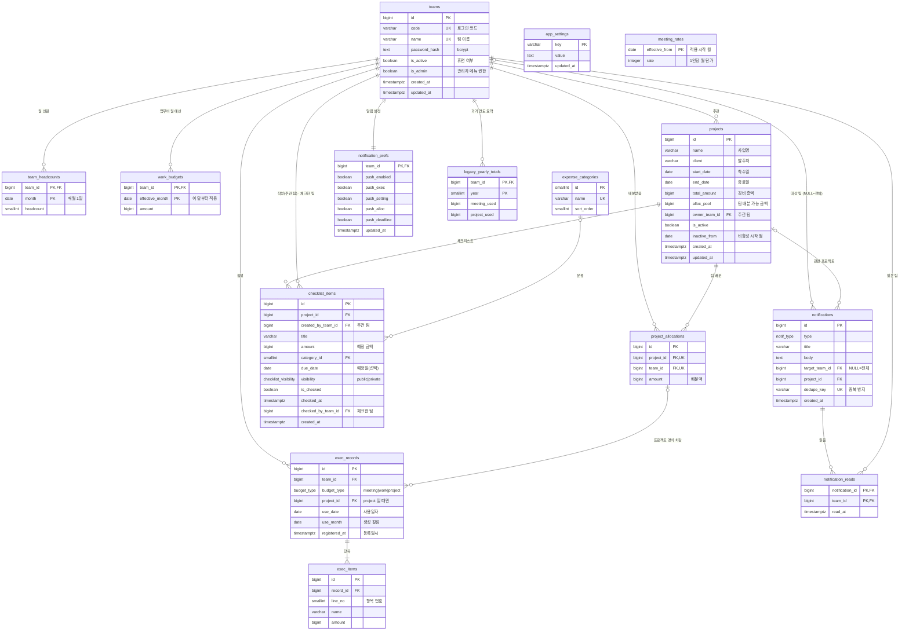

# 코웍-코인 DB 설계 (PostgreSQL)

- 파일: [`schema.sql`](schema.sql) — 테이블·제약·뷰 생성
- 실행: `psql -d cowork_coin -f db/schema.sql`
- 원칙: **입력값만 저장**하고, 사용액·잔액·분기 예산·집행률 같은 **계산값은 뷰(`v_*`)로 조회**합니다. 금액은 원 단위 `bigint`.

## 1. ERD

영역별로 보면 다음과 같습니다.

| 영역 | 테이블 |
|---|---|
| 팀·설정 | `teams`, `app_settings` |
| 팀 운영 예산 | `meeting_rates`, `team_headcounts`, `work_budgets` |
| 프로젝트 운영 | `projects`, `project_allocations`, `checklist_items`, `expense_categories` |
| 집행 | `exec_records`, `exec_items` |
| 알림 | `notifications`, `notification_reads`, `notification_prefs` |
| 리포트 이관 | `legacy_yearly_totals` |

## 2. 테이블 정의서

표기: **PK** 기본키 · **FK** 외래키 · **UK** 유일 · 필수 = NOT NULL

### teams — 팀 계정 (로그인 단위)
| 컬럼 | 타입 | 필수 | 키 | 설명 |
|---|---|:-:|:-:|---|
| id | bigint (identity) | ● | PK | |
| code | varchar(30) | ● | UK | 로그인·연동용 코드 (예: `dev`) |
| name | varchar(50) | ● | UK | 팀 이름 (예: 개발팀) |
| password_hash | text | ● | | `crypt(비밀번호, gen_salt('bf'))` — 평문 저장 안 함 |
| is_active | boolean | ● | | false = 휴면 (로그인 팀 선택에서 제외), 기본 true |
| is_admin | boolean | ● | | 팀 로그인만으로 관리자 메뉴 접근, 기본 false |
| created_at / updated_at | timestamptz | ● | | 수정 시 updated_at 자동 갱신 |

### app_settings — 시스템 설정 (키-값)
| 컬럼 | 타입 | 필수 | 키 | 설명 |
|---|---|:-:|:-:|---|
| key | varchar(50) | ● | PK | `admin_password_hash`(관리자 전용 계정), `reset_password_hash`(비밀번호 초기화 값) |
| value | text | ● | | |
| updated_at | timestamptz | ● | | |

### meeting_rates — 팀 회의비 1인당 월 단가 이력
| 컬럼 | 타입 | 필수 | 키 | 설명 |
|---|---|:-:|:-:|---|
| effective_from | date | ● | PK | 적용 시작 월 (매월 1일). 다음 변경 전까지 적용 |
| rate | integer | ● | | 1인당 월 단가 (> 0), 현재 30,000원 |

### team_headcounts — 팀 월별 인원
| 컬럼 | 타입 | 필수 | 키 | 설명 |
|---|---|:-:|:-:|---|
| team_id | bigint | ● | PK, FK→teams | |
| month | date | ● | PK | 매월 1일 |
| headcount | smallint | ● | | ≥ 0. **분기 회의비 예산 = Σ(월 인원 × 그 달 단가)** |

### work_budgets — 팀 업무비 월 예산
| 컬럼 | 타입 | 필수 | 키 | 설명 |
|---|---|:-:|:-:|---|
| team_id | bigint | ● | PK, FK→teams | |
| effective_month | date | ● | PK | 이 달부터 다음 입력 전까지 같은 금액 (이월 없음, 남으면 소멸) |
| amount | bigint | ● | | ≥ 0 |

### projects — 프로젝트
| 컬럼 | 타입 | 필수 | 키 | 설명 |
|---|---|:-:|:-:|---|
| id | bigint (identity) | ● | PK | |
| name | varchar(100) | ● | | 사업명 |
| client | varchar(100) | | | 발주처 |
| start_date / end_date | date | ● | | 착수일 / 종료일 (종료 ≥ 착수) |
| total_amount | bigint | ● | | 프로젝트 경비 총액 |
| alloc_pool | bigint | ● | | 코웍 팀 배분 가능 금액 (≤ 총액) |
| owner_team_id | bigint | ● | FK→teams | 주관(등록) 팀 |
| is_active | boolean | ● | | 기본 true |
| inactive_from | date | | | '이 달부터 비활성' 월 |
| created_at / updated_at | timestamptz | ● | | |

### project_allocations — 프로젝트 팀 배분 (= 참여 팀)
| 컬럼 | 타입 | 필수 | 키 | 설명 |
|---|---|:-:|:-:|---|
| id | bigint (identity) | ● | PK | |
| project_id | bigint | ● | FK→projects, UK(project_id, team_id) | 프로젝트 삭제 시 함께 삭제 |
| team_id | bigint | ● | FK→teams | |
| amount | bigint | ● | | 배분액. **팀 배분 합계 ≤ alloc_pool** (트리거, 트랜잭션 끝에 검사) |

- **삭제 제한** (트리거 `project_allocations_no_delete_used`): 사용액(프로젝트 경비 집행 이력)이 있는 팀 배분은 삭제할 수 없습니다. 앱은 삭제 대신 **배분액을 사용액으로 맞추기(잔액 0원)** 를 안내합니다.
- **지분율**은 저장하지 않고 `v_allocation_usage.share_pct` 로 계산합니다 (팀 배분액 ÷ 프로젝트 배분 총액). 주관 팀만 프로젝트 상세에서 봅니다.

### expense_categories — 경비 분류
| 컬럼 | 타입 | 필수 | 키 | 설명 |
|---|---|:-:|:-:|---|
| id | smallint (identity) | ● | PK | |
| name | varchar(20) | ● | UK | 식비 · 교통비 · 자재비 · 숙박비 · 기타 |
| sort_order | smallint | ● | | 표시 순서 |

### checklist_items — 경비 집행 체크리스트 (공개 / 비공개)
주관 팀이 만들고 공개 범위를 정합니다. 금액 기준은 **주관 팀의 My 경비 배분 금액**(project_allocations 중 주관 팀 행)이며, 참여 팀의 배분 예산과는 별개입니다. **공개** = 주관 팀 + 배분받은 코웍 팀이 보고 체크, **비공개** = 주관 팀만. 생성·삭제·공개 범위 변경은 주관 팀만.

| 컬럼 | 타입 | 필수 | 키 | 설명 |
|---|---|:-:|:-:|---|
| id | bigint (identity) | ● | PK | |
| project_id | bigint | ● | FK→projects | 프로젝트 삭제 시 함께 삭제 |
| created_by_team_id | bigint | ● | FK→teams | 작성 팀 = 프로젝트 주관 팀 (트리거 검사) |
| visibility | enum `checklist_visibility` | ● | | `public` 공개(기본) · `private` 비공개 |
| checked_by_team_id | bigint | | FK→teams | 체크한 팀 — 주관 팀 또는 공개 항목의 배분받은 팀 (트리거 검사) |
| title | varchar(100) | ● | | 항목명 |
| amount | bigint | ● | | 예정 금액 |
| category_id | smallint | | FK→expense_categories | |
| due_date | date | | | 예정일 (없으면 '예정일 없음') |
| is_checked | boolean | ● | | 기본 false |
| checked_at | timestamptz | | | 체크한 시각 (미체크면 NULL) |
| created_at | timestamptz | ● | | 항목 번호는 생성 순서 |

### exec_records — 집행 등록 (헤더)
| 컬럼 | 타입 | 필수 | 키 | 설명 |
|---|---|:-:|:-:|---|
| id | bigint (identity) | ● | PK | |
| team_id | bigint | ● | FK→teams | 집행한 팀 |
| budget_type | enum `budget_type` | ● | | `meeting` 팀 회의비 · `work` 팀 업무비 · `project` 프로젝트 경비 |
| project_id | bigint | | FK→project_allocations(project_id, team_id) | `project`일 때만 필수 — 배분받은 팀만 집행 |
| use_date | date | ● | | 사용일자 |
| use_month | date | ● | | **생성 컬럼** = 사용일자의 월 1일 (예산 집계 기준) |
| registered_at | timestamptz | ● | | 등록일시 |

### exec_items — 집행 항목 (상세)
| 컬럼 | 타입 | 필수 | 키 | 설명 |
|---|---|:-:|:-:|---|
| id | bigint (identity) | ● | PK | |
| record_id | bigint | ● | FK→exec_records | 집행 삭제 시 함께 삭제 |
| line_no | smallint | ● | UK(record_id, line_no) | 항목 번호 |
| name | varchar(100) | ● | | 항목명 |
| amount | bigint | ● | | > 0 |

### notifications — 알림
| 컬럼 | 타입 | 필수 | 키 | 설명 |
|---|---|:-:|:-:|---|
| id | bigint (identity) | ● | PK | |
| type | enum `notif_type` | ● | | exec · setting · alloc · deadline · budget · project · admin · system |
| title | varchar(100) | ● | | |
| body | text | ● | | |
| target_team_id | bigint | | FK→teams | NULL = 모든 팀 |
| project_id | bigint | | FK→projects | 관련 프로젝트 (삭제 시 NULL) |
| dedupe_key | varchar(100) | | UK | 중복 발송 방지 (예: 기한 임박은 프로젝트·종료월당 1회) |
| created_at | timestamptz | ● | | |

### notification_reads — 알림 읽음 (팀별)
| 컬럼 | 타입 | 필수 | 키 | 설명 |
|---|---|:-:|:-:|---|
| notification_id | bigint | ● | PK, FK→notifications | |
| team_id | bigint | ● | PK, FK→teams | 전체 대상 알림도 팀마다 따로 읽음 |
| read_at | timestamptz | ● | | |

### notification_prefs — 팀별 알림 설정
| 컬럼 | 타입 | 필수 | 키 | 설명 |
|---|---|:-:|:-:|---|
| team_id | bigint | ● | PK, FK→teams | |
| push_enabled | boolean | ● | | 기기 푸시 전체 on/off (기본 off) |
| push_exec / push_setting / push_alloc / push_deadline | boolean | ● | | 종류별 푸시 on/off (기본 on) |
| updated_at | timestamptz | ● | | |

### legacy_yearly_totals — 과거 연도 집행 요약 (이관분)
| 컬럼 | 타입 | 필수 | 키 | 설명 |
|---|---|:-:|:-:|---|
| team_id | bigint | ● | PK, FK→teams | |
| year | smallint | ● | PK | 상세 이력이 없는 과거 연도 (리포트 연도별 비교용) |
| meeting_used / project_used | bigint | ● | | 연간 회의비 / 프로젝트 집행액 |

## 3. 계산값 조회 (뷰 · 함수)

| 이름 | 앱에서 쓰는 곳 | 내용 |
|---|---|---|
| `v_exec_records` | 집행 현황 | 집행 1건 + 항목 합계(`total`) · 항목 수 |
| `v_allocation_usage` | 프로젝트 상세 › 팀 배분 | 프로젝트 × 팀 배분액 · 사용액 · 잔액 · **지분율(`share_pct`)** |
| `v_project_owner_budget` | My 체크리스트 · 코웍 체크리스트 · 상세 체크리스트 | 체크리스트 기준 예산 = 주관 팀의 My 경비 배분 금액 · 사용액 · 잔액 |
| `v_project_summary` | 프로젝트 목록 | 배분 가능 금액 · 사용액 · 잔액 · 집행률 |
| `v_team_projects` | My 프로젝트 | 팀이 주관(`owner`)하거나 배분받은(`participant`) 프로젝트 |
| `v_team_checklist` | 프로젝트 운영 › My 체크리스트 (`role='owner'`) · 코웍 체크리스트 메뉴 (`role='participant'`) · 홈 (My/코웍 태그) | 팀별로 보이는 체크리스트 — 주관 프로젝트는 전부, 참여 프로젝트는 공개 항목만 (`role` 표시) |
| `v_team_meeting_quarters` | 팀 회의비 분기표 · 홈 | 팀 · 연도 · 분기별 인원 합, 예산, 사용액, 잔액 |
| `v_team_work_months` | 팀 업무비 표 · 홈 | 팀 · 월별 업무비 예산(이전 입력값 이어 받음), 사용액 |
| `v_team_notifications` | 알림 | 팀별 받은 알림 + 읽음 여부 |
| `meeting_rate_of(월)` | | 그 달에 적용되는 회의비 단가 |
| `work_budget_of(팀, 월)` | 집행 등록 잔액 표시 | 그 달의 업무비 예산 |

## 4. 현재 앱 저장 구조에서 바뀐 점

| 현재 (localStorage) | DB 설계 | 이유 |
|---|---|---|
| 팀을 이름(`'개발팀'`)으로 연결 | `team_id` 외래키 | 팀 이름을 바꿔도 이력이 끊기지 않음 |
| `password` 평문 | `password_hash` (bcrypt) | 보안 |
| `Project.used`, `AllocRow.used`, `QuarterData.used` 저장 | 저장 안 함 → `v_*` 뷰로 계산 | 집행 이력과 숫자가 어긋나지 않음 |
| `Project.isMine` | `v_team_projects` (주관 또는 배분) | 로그인한 팀마다 다르게 계산되는 값 |
| `QuarterData.budget` 저장 | `team_headcounts` × `meeting_rates` | 인원·단가가 바뀌면 예산이 자동 반영, 과거 단가 유지 |
| `meetingRate` 1개 | `meeting_rates` 이력 | 단가 변경 전 분기는 옛 단가로 계산 |
| `ExecRecord.items` 배열 · `total` | `exec_items` 테이블, 합계는 뷰 | 항목별 검색·집계 가능 |
| `ExecRecord.month` · `date` 문자열 | `use_date` + 생성 컬럼 `use_month`, `registered_at` | 사용월이 사용일자와 항상 일치 |
| 회의비 집행에 팀 없음 | 모든 집행에 `team_id` 필수 | 여러 팀이 같은 DB를 씀 |
| 체크리스트에 팀 없음 | `created_by_team_id`(주관 팀) · `checked_by_team_id` · `visibility` | 공개 항목은 참여 팀도 보고 체크 |
| 알림 `read` 1개 | `notification_reads` (팀별) | 전체 대상 알림을 팀마다 따로 읽음 |
| `time: '2시간 전'` | `created_at` 시각 | '~전' 표시는 앱에서 계산 |
| `monthly`, `projectMonthly`, `YEARLY_BUDGET` | 저장 안 함 → 집행 이력에서 집계 | 중복 데이터 제거 |
| `YEARLY_HISTORY` | `legacy_yearly_totals` | 상세 이력 없는 과거 연도만 요약으로 보관 |
| 팀 배분 지분율 (화면 계산) | `v_allocation_usage.share_pct` | 배분액이 바뀌면 자동 반영 |
| 사용액 있는 팀 배분 삭제 (화면에서 막음) | 트리거 `project_allocations_no_delete_used` | 다른 경로(API·일괄 작업)로도 삭제 불가 |
| 리포트 보기 형식(카드/리스트), 조회 필터 | 저장 안 함 (기기별 브라우저 저장) | 팀 데이터가 아닌 화면 설정 |

## 5. 확인이 필요한 점 (설계 가정)

1. **프로젝트 경비 집행은 배분받은 팀만** 가능하도록 막았습니다 (외래키). 주관 팀도 배분이 있어야 집행할 수 있습니다. 체크리스트는 주관 팀이 만들고, 공개 항목은 배분받은 팀도 체크합니다.
2. **사용액 숫자**: 앱의 저장된 합계와 달리 DB는 집행 이력으로 계산합니다. 실제 이관 시에는 집행 이력 전체를 옮겨야 일치합니다.
3. **영수증 이미지**와 **기기 푸시 구독 정보**는 현재 앱이 저장하지 않아 제외했습니다. 필요하면 `exec_receipts`, `push_subscriptions` 테이블을 추가합니다.

## 6. 검증

공개본은 빈 데이터로 시작합니다. 실제 이관 데이터를 넣은 뒤 스키마 제약과 집계 결과를 다시 검증해야 합니다.
